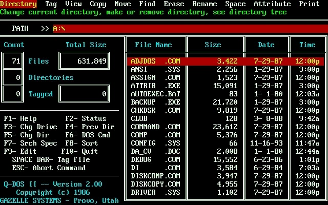
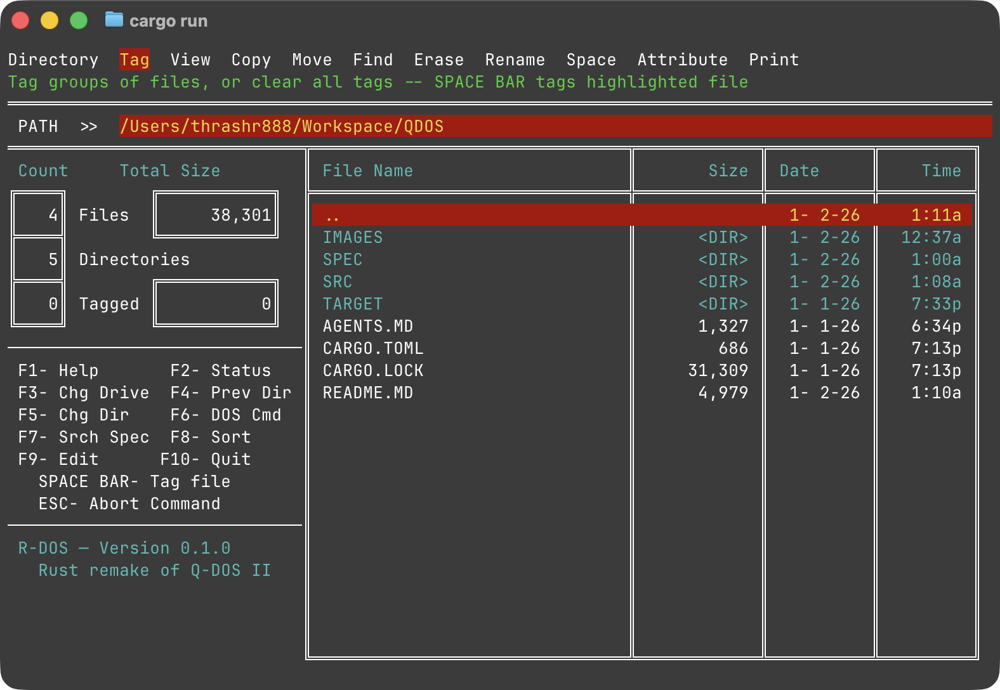
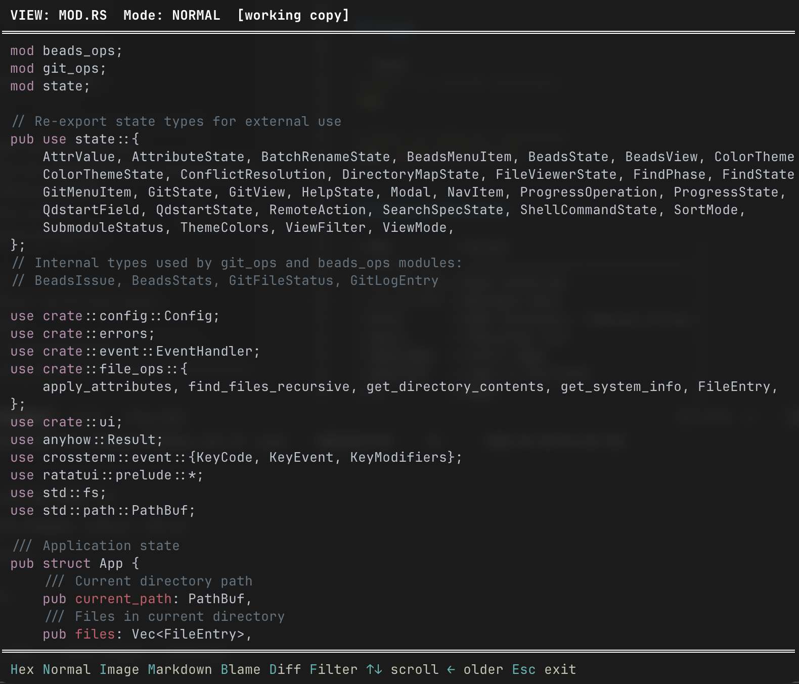
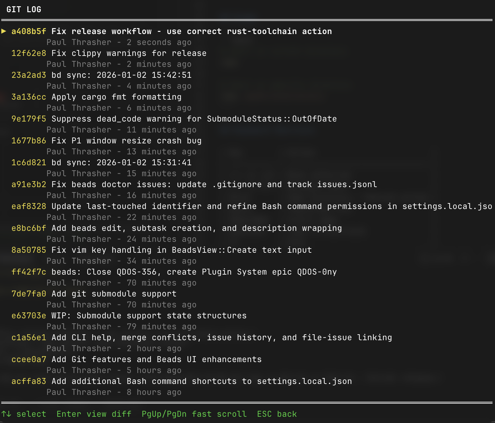
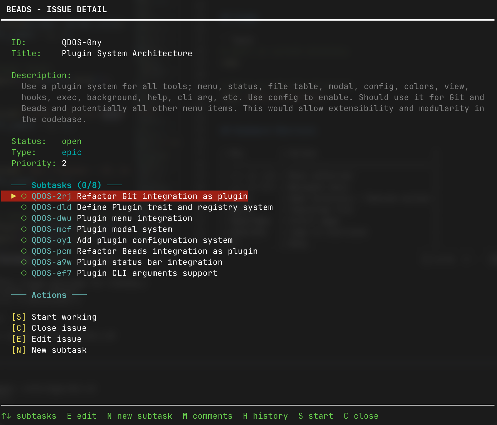

# R-DOS

A retro DOS-style file manager for the terminal, written in Rust.

R-DOS is inspired by the classic QDOS file manager, reimagined as a modern Terminal User Interface (TUI) using the [ratatui](https://ratatui.rs/) library. It aims for a 1:1 recreation of the original QDOS file manager, with a few modern enhancements.



I loved Q-DOS so here it is as a terminal app. Watch it in action: [Q-DOS II Demo on YouTube](https://www.youtube.com/watch?v=82j6NpSDTWQ)

Since it's somewhat tough to find, I'm rehosting [Q-DOS II for DOSBox](http://thrashr888.s3.amazonaws.com/Q-DOS%20II%20Version%202.0%20-%205.25.7z).

Q-DOS II is Copyright (c) 1991 Gazelle Systems.

## Features

- **Retro DOS Aesthetic**: Black background with cyan, green, red, and yellow colors reminiscent of classic DOS file managers
- **Directory Navigation**: Browse directories with arrow keys, Enter to open, F4 for parent directory
- **File Listing**: View files with name, git status, kind, size, date, and time columns
- **File Tagging**: Mark files with Space key for batch operations
- **Sorting**: 9 different sort modes (F8 to cycle) - by name, extension, size, or date (ascending/descending)
- **File Viewing**: View the contents of any file on the screen (in "ASCII", "HEX", "MARKDOWN", or "IMAGE")
- **Syntax Highlighting**: Highlight the contents of any file in the viewer
- **Git Integration**: View Git status, log, diff, and commit history
- **Beads Integration**: View and manage Beads issues and comments
- **Keyboard-First Interface**: All actions accessible via keyboard shortcuts
- **Modal Dialogs**: Help (F1), Status (F2), Disk Space (Space menu), and more
- **Cross-Platform**: Works on macOS, Linux, and Windows

## Installation

```bash
# Clone the repository
git clone https://github.com/thrashr888/QDOS.git
cd QDOS

# Build and run
cargo run

# Or build release version
cargo build --release
./target/release/rdos
```

## Usage

```bash
# Start in current directory
rdos

# Start in specific directory
rdos /path/to/directory
```

## Keyboard Shortcuts

| Key        | Action                          |
| ---------- | ------------------------------- |
| ↑/↓ or j/k | Move selection                  |
| ←/→ or h/l | Navigate menu                   |
| Enter      | Open directory / Execute action |
| Space      | Tag/untag file                  |
| PgUp/PgDn  | Scroll page                     |
| Home/End   | Jump to start/end               |
| F1         | Help                            |
| F2         | System Status                   |
| F4         | Parent Directory                |
| F5         | Change Directory                |
| F7         | Search Specification            |
| F8         | Cycle Sort Mode                 |
| F10 or q   | Quit                            |
| Esc        | Close dialog                    |
| Ctrl+C     | Force quit                      |

## Navigation Menu

- **Directory**: Change current directory, make or remove directory, see directory tree
- **Tag**: Tag groups of files, or clear all tags (SPACE BAR tags highlighted file)
- **View**: View the contents of any file on the screen (planned)
- **Copy**: Copy one or several files to another disk or directory
- **Move**: Move one or several files from this directory to another directory
- **Find**: Search all directories on the disk to find specified file(s) (planned)
- **Erase**: Erase one or several files from this directory
- **Rename**: Rename one or several files in this directory
- **Space**: Show the total, used, and free space on any disk
- **Attribute**: Change/view file attributes (planned)
- **Print**: Print one or several files on the printer (planned)

## Screenshots









## Dependencies

- [ratatui](https://crates.io/crates/ratatui) - Terminal UI framework
- [crossterm](https://crates.io/crates/crossterm) - Cross-platform terminal manipulation
- [tokio](https://crates.io/crates/tokio) - Async runtime
- [chrono](https://crates.io/crates/chrono) - Date/time handling
- [humansize](https://crates.io/crates/humansize) - Human-readable file sizes
- [sysinfo](https://crates.io/crates/sysinfo) - System information
- [anyhow](https://crates.io/crates/anyhow) - Error handling
- [walkdir](https://crates.io/crates/walkdir) - Directory traversal

## License

Copyright 2026 Paul Thrasher

Permission is hereby granted, free of charge, to any person obtaining a copy of this software and associated documentation files (the “Software”), to deal in the Software without restriction, including without limitation the rights to use, copy, modify, merge, publish, distribute, sublicense, and/or sell copies of the Software, and to permit persons to whom the Software is furnished to do so, subject to the following conditions:

The above copyright notice and this permission notice shall be included in all copies or substantial portions of the Software.

THE SOFTWARE IS PROVIDED “AS IS”, WITHOUT WARRANTY OF ANY KIND, EXPRESS OR IMPLIED, INCLUDING BUT NOT LIMITED TO THE WARRANTIES OF MERCHANTABILITY, FITNESS FOR A PARTICULAR PURPOSE AND NONINFRINGEMENT. IN NO EVENT SHALL THE AUTHORS OR COPYRIGHT HOLDERS BE LIABLE FOR ANY CLAIM, DAMAGES OR OTHER LIABILITY, WHETHER IN AN ACTION OF CONTRACT, TORT OR OTHERWISE, ARISING FROM, OUT OF OR IN CONNECTION WITH THE SOFTWARE OR THE USE OR OTHER DEALINGS IN THE SOFTWARE.
